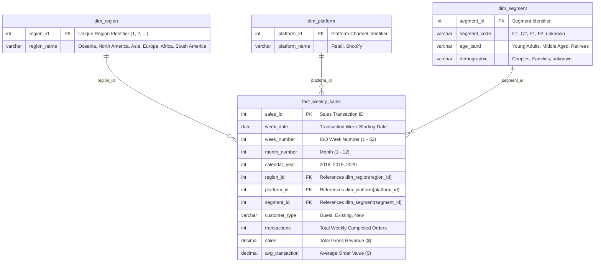

# 🛒 Retail Sales Intelligence & Analytics Dashboard

[](https://www.python.org/)
[](https://streamlit.io/)
[](https://plotly.com/)
[](https://www.mysql.com/)
[](https://opensource.org/licenses/MIT)

An enterprise-grade Business Intelligence and Data Warehousing application built using **SQL (MySQL & SQLite)**, **Python**, **Streamlit**, and **Plotly**. The project normalizes 17,000+ multi-region retail sales transactions across physical and digital channels into an analytics-ready Star Schema and delivers executive business intelligence through an interactive 5-module dashboard.

---

## 🌟 Key Highlights

- **4-Table Normalized Star Schema**: Transformed flat raw data into a relational warehouse schema (`dim_region`, `dim_platform`, `dim_segment`, and `fact_weekly_sales`) with Primary and Foreign Key constraints.
- **Dual-Engine Zero-Config Architecture**: Connects seamlessly to **MySQL** (via `.env` configuration) or auto-compiles a local **SQLite** database (`data_mart.db`) directly from CSV on first launch with zero manual setup.
- **30+ Production SQL Queries**: Demonstrates multi-table `INNER JOIN`s, `LEFT JOIN`s, Common Table Expressions (CTEs), Window Functions (`LAG()`, `RANK()`, `DENSE_RANK()`), and 4-week rolling moving averages (`ROWS BETWEEN 3 PRECEDING AND CURRENT ROW`).
- **Security & Data Sanitization**: Completely eliminates SQL injection vulnerabilities using parameterized SQL placeholders (`%s` / `?`) and environment variable isolation (`.env.example`).
- **5-Module Interactive Dashboard**: Executive KPI tracking, temporal sales analysis, demographic segmentation, rescaled policy intervention analysis, and omni-channel expansion with live **CRUD Data Management**.

---

## 💡 Key Business Findings

1. **Sustainable Packaging Policy Impact**: Analyzing the 2020 sustainable packaging rollout (Week 25) revealed a **-$152.3M (-2.14%)** revenue variance over the standard 12-week evaluation window (Weeks 13–24 vs. Weeks 25–36).
2. **Omni-Channel Economics**: While physical Retail accounts for the bulk of volume (~97.5% share), **Shopify e-commerce orders command an Average Order Value (~$174)** nearly **5x higher** than physical stores (~$38).
3. **Demographic Revenue Concentration**: **Retirees and Families** represent the highest lifetime revenue cohorts across major regional markets (Oceania, Africa, and North America).

---

## 🏗️ Database Architecture (Star Schema ERD)



---

## 📊 Dashboard Modules

### 1. 📊 Executive Overview
- High-level KPI metric cards: Total Revenue, Completed Transactions, Average Order Value (AOV), and Active Regions.
- Aggregate monthly sales trajectory line charts and regional revenue distributions.
- Channel market share split (Retail vs. Shopify).

### 2. 📈 Sales Performance Analysis
- Dynamic calendar year selector (2018, 2019, 2020).
- Monthly revenue trends and platform contributions.
- Top 10 Performing Regions leaderboard table powered by relational `JOIN` queries.

### 3. 👥 Customer Demographic Analysis
- Family structure revenue contribution (Couples vs. Families).
- Age cohort segmentation (Young Adults, Middle Aged, Retirees).
- Customer Type breakdown (Guest, Existing, New loyalty tiers).
- Cross-demographic revenue and transaction matrix.

### 4. 💡 Executive Business Insights
- **Sustainable Packaging Intervention Impact**: Dynamically rescaled visual bars and KPI delta cards measuring revenue change.
- **Window Toggle**: Compare immediate short-term impact (4-Week Window: Weeks 21–24 vs. 25–28) vs. long-term impact (12-Week Window: Weeks 13–24 vs. 25–36).
- Multi-year annual trajectory comparison (2018–2020) with rescaled axes.

### 5. 🌐 Channel & Market Expansion Analysis
- **Omni-Channel Strategy**: Regional market share and digital penetration comparisons between physical stores and Shopify.
- **Demographic Digital Adoption**: Identifies customer segments with the highest online basket size.
- **Interactive CRUD Data Management**: Form to insert new sales transactions with foreign key constraint validation, plus a multi-row deletion table.

---

## 📁 Project Structure

```
Retail-Sales-Intelligence-Dashboard/
│
├── app.py                         # Streamlit multi-page landing application
├── db.py                          # Dual-engine database connection manager & query runner
├── requirements.txt               # Python package dependencies
├── README.md                      # Comprehensive project documentation
├── .env.example                   # Environment variable template for MySQL credentials
├── .gitignore                     # Git ignore rules (.env, *.pyc, *.db)
├── data_mart.db                   # SQLite Star Schema database (auto-generated)
│
├── pages/
│   ├── 1_Overview.py              # Executive KPIs & regional breakdowns
│   ├── 2_Sales_Analysis.py        # Temporal sales trends & regional leaderboards
│   ├── 3_Customer_Analysis.py     # Customer demographic & age cohort segmentation
│   ├── 4_Business_Insights.py     # Packaging rollout impact & rescaled metrics
│   └── 5_Channel_Expansion.py     # Omni-channel strategy & CRUD Data Management
│
├── sql/
│   ├── data_mart_setup.sql        # DDL & DML for Star Schema & Analytical View
│   ├── advanced_business_insights.sql # Multi-table JOINs, CTEs & Window queries
│   └── data_mart_solutions.sql    # 25+ SQL Challenge business challenge solutions
│
└── scripts/
    ├── build_star_schema.py       # Automated ETL pipeline (CSV -> Star Schema)
    ├── load_dataset.py            # MySQL loader utility
    └── weekly_sales.csv           # Clean raw weekly sales dataset (17,117 records)
```

---

## 🛠️ Technical & SQL Skills Demonstrated

| Competency | Implementation in Project |
| :--- | :--- |
| **Data Warehousing** | Designed a 4-table Star Schema with Primary & Foreign Key integrity; unified via analytical SQL Views. |
| **Relational JOINs** | Multi-table `INNER JOIN` and `LEFT JOIN` operations across Fact and Dimension tables. |
| **Window Functions** | `LAG()` for YoY/MoM growth, `RANK()` / `DENSE_RANK()` for regional ranking, and `ROWS BETWEEN 3 PRECEDING AND CURRENT ROW` for rolling averages. |
| **Common Table Expressions** | Multi-tiered `WITH` statements for layered cohort and before/after policy impact calculations. |
| **Application Security** | Fully parameterized SQL queries (`%s` / `?`) preventing SQL injection; credentials isolated in `.env`. |
| **Automated ETL** | Python/Pandas pipeline extracting CSV records, parsing dates, deriving demographic bands, and loading database tables. |

---

## 🚀 Quickstart & Installation

### 1. Clone the Repository
```bash
git clone https://github.com/<your_username>/Retail-Sales-Intelligence-Dashboard.git
cd Retail-Sales-Intelligence-Dashboard
```

### 2. Install Dependencies
```bash
pip install -r requirements.txt
```

### 3. Launch the Application

#### Option A: Instant Zero-Config Mode (SQLite - Default)
Simply run Streamlit! The app will automatically build `data_mart.db` from `scripts/weekly_sales.csv` on first launch:
```bash
streamlit run app.py
```

#### Option B: MySQL Mode (Optional)
If you prefer running against a local or cloud MySQL instance:
1. Copy `.env.example` to `.env`:
   ```bash
   cp .env.example .env
   ```
2. Set your credentials in `.env`:
   ```env
   DB_HOST=localhost
   DB_USER=root
   DB_PASSWORD=your_password
   DB_NAME=data_mart
   DB_PORT=3306
   ```
3. Run the Streamlit application:
   ```bash
   streamlit run app.py
   ```

## 📄 License & Usage

This project is open-source under the [MIT License](https://opensource.org/licenses/MIT). Created for portfolio demonstration, educational data warehousing, and business intelligence analytics.

