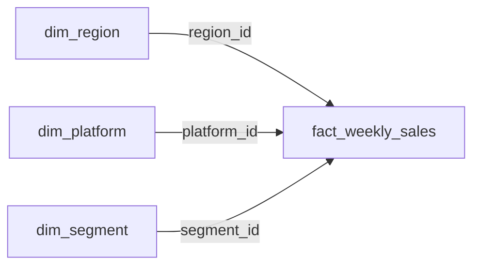

# 🛒 Retail Sales Intelligence & Predictive Demand Forecasting Platform

[](https://www.python.org/)
[](https://streamlit.io/)
[](https://plotly.com/)
[](https://xgboost.readthedocs.io/)
[](https://www.mysql.com/)
[](https://opensource.org/licenses/MIT)

An enterprise-grade Business Intelligence, Data Warehousing, and **Machine Learning Demand Forecasting Platform** built using **SQL (MySQL & SQLite)**, **Python**, **XGBoost**, **Streamlit**, and **Plotly**. 

The platform normalizes 17,000+ multi-region retail sales transactions into an analytics-ready **Star Schema** and combines descriptive executive business intelligence with a **Hierarchical Panel Time-Series ML Model** forecasting demand across 14 market streams.

---

## 🌟 Key Highlights

- **4-Table Normalized Star Schema**: Transformed flat raw data into a relational warehouse schema (`dim_region`, `dim_platform`, `dim_segment`, and `fact_weekly_sales`) with Primary and Foreign Key constraints.
- **🤖 Hierarchical Panel ML Pipeline (XGBoost)**: Trained across 14 distinct market streams (7 Regions x 2 Platforms) using auto-regressive lags, rolling momentum statistics, and calendar seasonality features with strict zero-lookahead engineering.
- **Production 5-Metric Evaluation Suite**: Evaluates model performance using **Pooled $R^2$**, **Model WAPE vs. Naive Baseline WAPE**, **Median Per-Series $R^2$**, and an **8-Week Multi-Step Planning Horizon Benchmark** (~32% relative error reduction over naive persistence).
- **Dual-Engine Zero-Config Architecture**: Connects seamlessly to **MySQL** (via `.env` configuration) or auto-compiles a local **SQLite** database (`data_mart.db`) directly from CSV on first launch with zero manual setup.
- **30+ Production SQL Queries**: Demonstrates multi-table `INNER JOIN`s, `LEFT JOIN`s, Common Table Expressions (CTEs), Window Functions (`LAG()`, `RANK()`, `DENSE_RANK()`), and 4-week rolling moving averages (`ROWS BETWEEN 3 PRECEDING AND CURRENT ROW`).
- **6-Module Interactive Dashboard**: Executive KPI tracking, temporal sales analysis, demographic segmentation, rescaled policy intervention analysis, omni-channel dynamics with CRUD management, and interactive **12-Week ML Demand Projections**.

---

## 💡 Key Business & Predictive Findings

1. **8-Week Forward Planning Edge**: In multi-step forward demand planning (8-week horizon without future ground truth), **XGBoost achieves 2.11% WAPE vs. Naive Baseline 3.10% WAPE** (~32% relative forecast error reduction).
2. **Sustainable Packaging Policy Impact**: Analyzing the 2020 sustainable packaging rollout (Week 25) revealed a **-USD 152.3M (-2.14%)** revenue variance over the standard 12-week evaluation window (Weeks 13–24 vs. Weeks 25–36).
3. **Omni-Channel Economics**: While physical Retail accounts for the bulk of volume (~97.5% share), **Shopify e-commerce orders command an Average Order Value of ~USD 174** — nearly **5x higher** than physical stores (~USD 38).
4. **Demographic Revenue Concentration**: **Retirees and Families** represent the highest lifetime revenue cohorts across major regional markets (Oceania, Africa, and North America).

---

## 🏗️ Database Architecture (Star Schema ERD)



---

## 📊 Dashboard Modules

### 1. 📊 Executive Overview
- High-level KPI metric cards: Total Revenue, Completed Transactions, Average Order Value (AOV), and Active Regions.
- Aggregate monthly sales trajectory line charts and regional revenue distributions.
- Channel market share split (Retail vs. Shopify).

### 2. 📈 Sales Performance Analysis
- Dynamic calendar year selector (2018, 2019, 2020).
- Monthly revenue trends and platform contributions.
- Top 10 Performing Regions leaderboard table powered by relational `JOIN` queries.

### 3. 👥 Customer Demographic Analysis
- Family structure revenue contribution (Couples vs. Families).
- Age cohort segmentation (Young Adults, Middle Aged, Retirees).
- Customer Type breakdown (Guest, Existing, New loyalty tiers).
- Cross-demographic revenue and transaction matrix.

### 4. 💡 Executive Business Insights
- **Sustainable Packaging Intervention Impact**: Dynamically rescaled visual bars and KPI delta cards measuring revenue change.
- **Window Toggle**: Compare immediate short-term impact (4-Week Window: Weeks 21–24 vs. 25–28) vs. long-term impact (12-Week Window: Weeks 13–24 vs. 25–36).
- Multi-year annual trajectory comparison (2018–2020) with rescaled axes.

### 5. 🌐 Channel & Market Expansion Analysis
- **Omni-Channel Strategy**: Regional market share and digital penetration comparisons between physical stores and Shopify.
- **Demographic Digital Adoption**: Identifies customer segments with the highest online basket size.
- **Interactive CRUD Data Management**: Form to insert new sales transactions with foreign key constraint validation, plus a multi-row deletion table.

### 6. 🤖 Predictive Demand Forecasting (Machine Learning)
- **Panel XGBoost Forecasting Engine**: Trained on 14 market streams with autoregressive lags (`lag_1`, `lag_2`, `lag_4`, `lag_8`), rolling means (`mean_4`, `mean_8`), rolling standard deviation, and calendar seasonality.
- **5-Metric Evaluation Suite**: Full metrics banner, Pooled $R^2$, Model WAPE vs. Naive Baseline, and per-stream diagnostics.
- **Interactive Market Filter**: Filter by region and platform to view Actual vs. Predicted time-series curves with chronological train/test split markers.
- **12-Week Recursive Future Projection**: Forward projection slider generating future demand forecasts with confidence intervals.
- **Feature Importance Analysis**: Gain-based feature attribution visualization.

---

## 📁 Project Structure

```
Retail-Sales-Intelligence-Dashboard/
│
├── app.py                         # Streamlit multi-page landing application
├── db.py                          # Dual-engine database connection manager & query runner
├── requirements.txt               # Python package dependencies (including xgboost, scikit-learn)
├── README.md                      # Comprehensive project documentation
├── .env.example                   # Environment variable template for MySQL credentials
├── .gitignore                     # Git ignore rules (.env, *.pyc, *.db)
├── data_mart.db                   # SQLite Star Schema database (auto-generated)
│
├── pages/
│   ├── 1_Overview.py              # Executive KPIs & regional breakdowns
│   ├── 2_Sales_Analysis.py        # Temporal sales trends & regional leaderboards
│   ├── 3_Customer_Analysis.py     # Customer demographic & age cohort segmentation
│   ├── 4_Business_Insights.py     # Packaging rollout impact & rescaled metrics
│   ├── 5_Channel_Expansion.py     # Omni-channel strategy & CRUD Data Management
│   └── 6_Demand_Forecasting.py    # XGBoost Panel ML Forecasting & 5-Metric Suite
│
├── ml/
│   ├── __init__.py                # ML module initialization
│   ├── feature_engineering.py     # Panel lag, rolling stats, and dummy encoding
│   ├── forecaster.py              # XGBoost model class, 5-metric evaluation, & recursive forecasting
│   ├── train.py                   # Standalone model training & evaluation script
│   └── models/
│       └── xgboost_demand_model.joblib # Serialized production XGBoost model
│
├── sql/
│   ├── data_mart_setup.sql        # DDL & DML for Star Schema & Analytical View
│   ├── advanced_business_insights.sql # Multi-table JOINs, CTEs & Window queries
│   └── data_mart_solutions.sql    # 25+ SQL Challenge business challenge solutions
│
└── scripts/
    ├── build_star_schema.py       # Automated ETL pipeline (CSV -> Star Schema)
    ├── load_dataset.py            # MySQL loader utility
    └── weekly_sales.csv           # Clean raw weekly sales dataset (17,117 records)
```

---

## 🛠️ Technical & Analytical Skills Demonstrated

| Competency | Implementation in Project |
| :--- | :--- |
| **Machine Learning (Time-Series)** | Hierarchical Panel XGBoost regressor, recursive multi-step forecasting, WAPE benchmarking, feature importance. |
| **Feature Engineering** | Partitioned autoregressive lags (`lag_1`, `lag_2`, `lag_4`, `lag_8`), rolling means/std, calendar seasonality, dummy encoding. |
| **Data Warehousing** | Designed a 4-table Star Schema with Primary & Foreign Key integrity; unified via analytical SQL Views. |
| **Relational JOINs** | Multi-table `INNER JOIN` and `LEFT JOIN` operations across Fact and Dimension tables. |
| **Window Functions** | `LAG()` for YoY/MoM growth, `RANK()` / `DENSE_RANK()` for regional ranking, and `ROWS BETWEEN 3 PRECEDING AND CURRENT ROW` for rolling averages. |
| **Application Security** | Fully parameterized SQL queries (`%s` / `?`) preventing SQL injection; credentials isolated in `.env`. |
| **Automated ETL** | Python/Pandas pipeline extracting CSV records, parsing dates, deriving demographic bands, and loading database tables. |

---

## 🚀 Quickstart & Installation

### 1. Clone the Repository
```bash
git clone https://github.com/<your_username>/Retail-Sales-Intelligence-Dashboard.git
cd Retail-Sales-Intelligence-Dashboard
```

### 2. Install Dependencies
```bash
pip install -r requirements.txt
```

### 3. (Optional) Train the Machine Learning Model
```bash
python ml/train.py
```
*(The pre-trained model is already included in `ml/models/xgboost_demand_model.joblib`).*

### 4. Launch the Application

#### Option A: Instant Zero-Config Mode (SQLite - Default)
```bash
streamlit run app.py
```

#### Option B: MySQL Mode (Optional)
1. Copy `.env.example` to `.env`:
   ```bash
   cp .env.example .env
   ```
2. Set your credentials in `.env`:
   ```env
   DB_HOST=localhost
   DB_USER=root
   DB_PASSWORD=your_password
   DB_NAME=data_mart
   DB_PORT=3306
   ```
3. Run the Streamlit application:
   ```bash
   streamlit run app.py
   ```

---

## 📄 License & Usage

This project is open-source under the [MIT License](https://opensource.org/licenses/MIT). Created for portfolio demonstration, educational data warehousing, and predictive business intelligence analytics.
